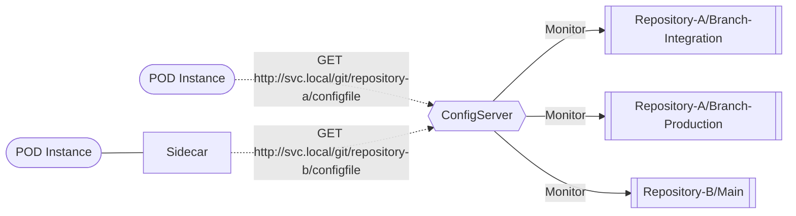

# configserver

```
Current status : Work In Progress but usable 😃
```

Nowadays a wide range of solutions exists when it comes to managing your running pod configuration, from secrets to AzureKeyVaults - I tried a lot of them but none really fitted my needs. Therefore I decided to write configserver.
(heavily) Inspired by spring-cloud-config, configserver is framework agnostic (written in goloang), and is aimed at cloud/kubernetes payloads to allows you to centrally manage your application configuration using gitops.

Configserver supports :

- mutliple git repositories for one central instance
- sensitive content encryption
- client based repository access
- and much more to come

## Philosophy

Configserver aims at simplicity and security (well it tries to) and limit its dependencies to a strict minimum

## Overview



## Getting Started

### Prepare your configuration file

ConfigServer one single configuration file for all its needs :

```yaml
environment:
  kind: production # If production logs are using JSON format if anything else logs are human readable
  home: /var/run/configserver # Not used yet

server:
  passPhrase: To infinity and beyond # Single passphrase used to encrypt sensitive content and generate client secrets
  listenOn: ":4200" # Port on which ConfigServer listens
  secretExpiryDays: 365 # Number of days a client secret is valid 
  validateSecretLifeSpan: false # If true will reject outdated secret, if false will only issue a warning in the logs

repositories:
  checkoutLocation: /tmp/configserver # Root path where the repositories are cloned
  configuration: # Configuration can contain multiple git repositories, they will be accessible via the /git/{name} url
    - name: configserver-samples-integration 
      url: https://github.com/fredjeck/configserver-samples
      branch: integration # Name of the branch to be checked out, if not provided defaults to main
      refreshIntervalSeconds: 3600 # Interval at which the repository is updated locally
      clients: # List of allowed client Ids
        - myclientid
        - sample_client
```

### Run your configserver

In a pod simply run the `configserver` executable optionally using the `-c` switch to specify the configuration location.
By default the configuration file **configserver.yml** will be located in `/var/run/configserver`

### Prepare your repositories

If your configuration files contain sensitive contents, enclose the sensitive values within the `{enc:}` tag. For instance
```yaml
password = 'SECRETPASSWORD'
```
will become
```yaml
password = '{enc:SECRETPASSWORD}'
```

Then use the tokenize endpoint of your running endpoint to convert your file :

```shell
curl --request POST \
  --url http://localhost:4200/api/tokenize \
  --data 'password = '\''{enc:SECRETPASSWORD}'\'''
```

which would result in :
```yaml
password = '{enc:HGSrEasO3EDYdTA5w+259/4hCxfmlIKh6i7wwZF9eFIg9kFwF7iMjg4T}'
```

And commit the resulting file in your repository

## Using configserver

Configserver offers a simple API for all common tasks

### Registering a new client

```shell
curl --request GET \
  --url 'http://localhost:4200/api/register?client_id=myclientid'
```

Will generate a client secret for the provided client id

```json
{
  "client_id": "myclientid",
  "client_secret": "LjTo0NW7Fq0LLfpGFkJRWSlLvlETeEOt5T53zyWLJyqSI4BvlG8MehGK28RoG2LCJZ2VGDO2vU6PM3MwN/5TNw==",
  "expires_at": "2025-04-01T21:04:11.357903614+02:00"
}
```

### Obtaining repository statistics

```shell
curl --request GET \
  --url http://localhost:4200/stats
```

returns

```json
{
  "configserver-samples-integration": {
    "hitCount": 0,
    "lastUpdate": "2024-04-01T20:56:31.559944915+02:00",
    "nextUpdate": "2024-04-01T21:56:32.541023156+02:00",
    "lastError": null
  }
}
```

### Accessing Content

Repository content requires the generated ClientID and Secret to be provided as part of a Basic Auth scheme [See MDN docs](https://developer.mozilla.org/en-US/docs/Web/HTTP/Authentication).

Repositories are accessible via the `/git/{repository name}/{path}` endpoint where :
- **repository name** is the name given in the configuration
- **path** is a path fragment from the repository root

```shell
curl --request GET \
  --url http://localhost:4200/git/configserver-samples-integration/configuration/branch.md
```

#### Repository ACL

For a ClientID to be allowed to browse a repository, the ClientID must be declared in the **clients** section of the configserver.yml file for the repository.